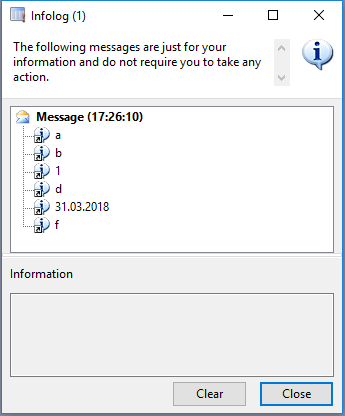

# SysEnumerators

*SysEnumerators* - это набор классов на языке X++, который позволяет разработчику единообразно "пробежать" по:

* интервалу чисел;
* интервалу дат;
* элементам контейнера;
* элементам коллекций Аксапты (`array`, `set`, `map`, `list`);
* элементам коллекций из .Net-пространства `System.Collections` (как с [генериками](https://msdn.microsoft.com/library/system.collections.generic.aspx), так и [без них](https://msdn.microsoft.com/ru-ru/library/system.collections.aspx));
* промаркированным на форме записям;
* записям `QueryRun`, `Query`, `select Table where...`;
* записям из коллекций `RecordSortedList`, `RecordLinkList`;
* элементам `TreeNode`;
* элементам коллекций Dict-классов;
* XML-элементам
* файлам (`CommaIo`, `AsciiIo`, `BinaryIo`, `TextIo`);
* и прочим системным коллекциям Аксапты.

Подробнее о *SysEnumerators* для [Microsoft Dynamics AX 2009](/ax2009) можно почитать в каталоге [ax2009](/ax2009).

## Пример использования SysEnumerators



```java
container c = ['a', 'b', 1, 'd', systemdateget(), 'f'];
SysEnumerator se = SysEnumerator::newFromContainer(c);

while( se.moveNext() )
{
    info(strfmt("%1", se.current()));
}
```

Больше примеров с описанием и скриншотами результатов можно найти в каталоге [Examples](ax2009/Src/Examples).

## Благодарности

Спасибо [Ивану Захарову](ivan@zakharov.com) и Роману Долгополову (RDOL, [db](https://axforum.info/forums/member.php?u=2836)), на проекте которых я убедился что энумераторы реально снижают время разработки, а вопросы быстродействия энумераторов легко решаются после профилирования кода и выявления узких мест.

Спасибо Дмитрию Толстову ([damn](https://axforum.info/forums/member.php?u=1465)) за вклад в данный проект.

## Disclaimer

* Названия классов и методов, иерархия и порядок вызовов в наборе классов  будут по возможности сохраняться, но это не гарантируется - в будущих версиях *SysEnumerators* все может измениться.
* Код в xpp-файлах конвертирован из xpo только для удобства использования человеком.  Оригиналом является код в xpo-проектах, отличия между xpo и xpp всегда трактуются в пользу текста из xpo-проектов.
* Проект выложен "как есть" под лицензией [MIT](LICENSE): вы можете использовать данный код как угодно безо всяких отчислений, автор не дает никаких гарантий и не несет ответственности за возможный эффект от использования кода на проектах.

## ChangeLog

[https://github.com/mazzy-ax/SysEnumerators/releases](https://github.com/mazzy-ax/SysEnumerators/releases)

## Помощь проекту

Буду признателен за ваши замечания, предложения, советы в разделе [Issues](https://github.com/mazzy-ax/SysEnumerators/issues) и [Pull requests](https://github.com/mazzy-ax/SysEnumerators/pulls) по проекту, а также в виде письма на адрес [mazzy@mazzy.ru](mailto:mazzy@mazzy.ru)

Мазуркин Сергей (mazzy)