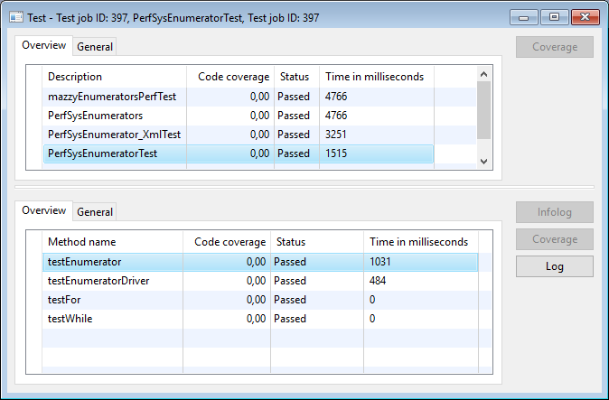
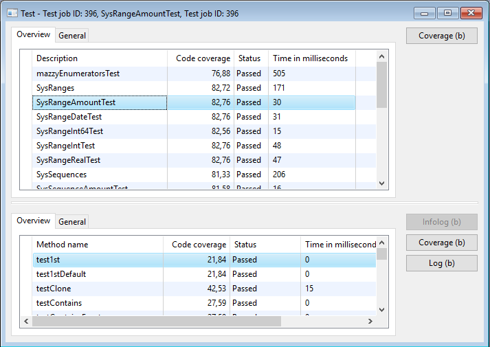

# SysEnumerators

*SysEnumerators* - это набор классов на языке X++ системы Microsoft Dynamics AX 2009. Набор, который позволяет разработчику единообразно "пробежать" по:

* интервалу чисел;
* интервалу дат;
* элементам контейнера;
* элементам коллекций Аксапты (`array`, `set`, `map`, `list`, `struct`);
* элементам `enum`;
* элементам коллекций из .Net-пространства `System.Collections` (как с [генериками](https://msdn.microsoft.com/library/system.collections.generic.aspx), так и [без них](https://msdn.microsoft.com/ru-ru/library/system.collections.aspx));
* промаркированным на форме записям;
* записям `QueryRun`, `Query`, `select Table where...`;
* записям из коллекций `RecordSortedList`, `RecordLinkList`;
* элементам `TreeNode`;
* элементам коллекций Dict-классов;
* XML-элементам;
* файлам (`CommaIo`, `AsciiIo`, `BinaryIo`, `TextIo`);
* строкам, словам и regexp-токенам из `TextBuffer`;
* и прочим системным коллекциям Аксапты.

*SysEnumerators* также позволяет группировать несколько энумераторов. Разработчик может использовать группу в тех местах кода, где можно использовать обычный энумератор. Причем код менять не нужно. *Группа* вызывает `moveNext` у всех своим энумераторов при вызове метода `moveNext` группы и возвращает `false`, если хотя бы один возвратил `false`. Также работают методы `reset` и `skip`. Группа возвращает значение `current` одного из своих энумераторов.

Проект *SysEnumerators* содержит классы с интерфейсом энумератора, которые становятся очень полезными только в группе. Это энумераторы:

* для отбора первых N значений из коллекции;
* для подсчета и индексации проэнумерированных значений;
* для индикации прогресса `SysOperationProgress`, `RunBaseProgress`,
* для сбора проитерированных значений в Set.

В проект *SysEnumerators* также входят семейства классов `SysRange` и `SysSequences`, которые позволяют явно определить интервалы и арифметические прогрессии для энумераторов.

К стандартному интерфейсу [Enumerator](https://msdn.microsoft.com/library/system.collections.ienumerator.aspx) с методами `moveNext`, `current`, `reset` добавлены методы `skip`, `estimatedIterations`, `currentIdx`, `currentKey`, `currentValue`. Получившийся интерфейс `ISysEnumerator` позволяет покрыть большинство задач, которые возникают при разработке в Аксапте.

Энумераторы реально ускоряют разработку и облегчают понимание чужого кода. С энумераторами разработчику не нужно помнить какие методы отвечают за перебор нужных ему данных, разработчику не нужно заботиться о хранении индекса, длины коллекции, не нужно вспоминать где индекс начинается с нуля, а где с единицы. Разработчику достаточно выбрать подходящий энумератор и единообразно задать цикл.

## Примеры использования SysEnumerators

В каталоге [Examples](Examples) можно увидеть и код, и скриншоты с результатами для некоторых примеров работы *SysEnumerators*:

1. Пробежать по интервалу чисел от 2 до 9 с шагом 3;
2. Пробежать по интервалу дат с шагом 5 дней;
3. Пробежать по элементам контейнера;
4. Пробежать по перечислению enum;
5. Пробежать по полям таблицы;
6. Пробежать по CSV-файлу;
7. Работа с группой энумераторов.

В xpo-проекте примеры представлены в виде Job.

## Состав проекта

Xpo-файл содержит экспортированные "чистой" Аксапты объекты. После импорта этих файлов в свою Аксапту, разработчик получит три Shared проекта:

* mazzyEnumerators - все объекты набора *SysEnumerators*. После компиляции этого проекта, разработчик может использовать классы набора *SysEnumerator*.
* mazzyEnumeratorsTest - только тестовые классы для проверки функциональности набора набора *SysEnumerators*. Название этого проекта можно указывать в панели модуля unit-тестирования для быстрого unit-тестирования всех классов набора. Unit-тестирование также можно запускать из самого проекта. В настройках проекта включен расчет `% покрытия`, поэтому тестирование "из проекта" будет выполняться дольше. См. галку `Record code coverage` в настройках проекта.
* mazzyEnumeratorsPerfTest - тестовые классы для проверки производительности некоторых классов.

## Хотелки, аспекты дизайна проекта SysEnumerators

Перечислены в порядке убывания приоритета:

1. Набор не должен требовать, чтобы разработчик импортировал задействовал что-то еще нестандартное. Другими словами, набор не должен полагаться, что в Аксапте присутствует нестандартный функционал.
1. Набор не должен изменять поведение стандартного функционала, возможно только минимальное добавление нового функционала к стандартным объектам.
1. Разработчику должно быть удобно пользоваться классами *SysEnumerators*: Intellisence-подсказки и контроль типов во время компиляции должны работать насколько, насколько это возможно для Аксапты. Насколько это возможно в качестве типов возвращаемых значений, должны использоваться самые конкретные, не базовые типы и не интерфейсы.
1. В Аксапте нет генериков, поэтому приходится создавать разные классы с почти одинаковыми методами и с почти одинаковым кодом, которые отличаются только типами. Должна быть последовательная и удобная для разработчика система наименований.
1. В Аксапте нет перегрузки методов для каждого метода фабрики необходимо придумать отдельное наименование. Должна быть последовательная и удобная для разработчика система наименований.
1. Энумераторы должны быть настолько производительными, насколько это возможно для виртуальной Java-машины первого поколения;
    * Ради производительности в runtime не должно быть проверок в runtime внутри циклов;
    * Вне цикла (как правило, при инициализации) допустимы только самые простые и быстрые проверки. Как правило, это проверки на соблюдение контракта в new;
1. В AX 2009 не желательно "создавать" развесистые и многоуровневые иерархии классов и интерфейсов, которые требуют кастов `as` и runtime-проверок `is` внутри цикла. Прежде всего, из-за низкой производительности `as`, `is` в `SysDictClass`;
1. По возможности не стоит использовать метки. Вместо них, стоит использовать стандартные сообщения класса `Error`.
1. Тестовые классы должны поставляться вместе с рабочими.

## Производительность

В составе набора *SysEnumerators* поставляется класс [Class_PerfSysEnumeratorTest.xpp](Src/PerfSysEnumerators/Class_PerfSysEnumeratorTest.xpp), который 5000 раз в цикле выполняет одно и то же. Но цикл создается разными методами.

* testEnumerator - использует стандартную фабрику, которая создает группу с одним энумератором. Тест показывает самое большое время выполнения среди всех методов.
* testEnumeratorDriver - использует конкретный энумератор без группы. Тест показывает вдвое меньшее время, чем для предыдущего теста.
* testFor и testWhile - цикл for и while соответственно. Как правило, модуль unit-тестирования не успевает сработать и показывает 0 или минимальное время 15 миллисекунд.

Фабрика `SysEnumerator` это самый простой для разработчика способ использования энумераторов - разработчик должен помнить про единственный класс и из выпадающего списка должен выбрать подходящий статический метод для создания энумератора. Разработчику будет очень просто добавить дополнительное условие или еще один энумератор в группу. См. [пример использования группы](Src/Examples/Job_SysEnumeratorExample07_Group.xpp).

Если разработчик знает систему наименований нумераторов и правильно выберет один из несколько сотен энумераторов и не будет использовать дополнительные возможности группы (подсчет числа итераций, отображение прогресса, First, сбор значений в set), то разработчик может повысить производительность вдвое.

Если разработчик воспользуется обычным функционалом Аксапты без энумераторов (озадачится контролем границ цикла и созданием необходимых промежуточных переменных), то он не получит никаких удобств и не получит ускорения разработки. Зато теоретически, разработчик может добиться максимальной производительности.

Каждое удобство имеет свою цену - удобные для разработчика энумераторы сокращают время разработки, но потребляют дополнительное время и память компьютера.

## Дальнейшие планы на SysEnumerators

* Выбрать оптимальные названия классов и методов при помощи сообщества профессионалов, с учетом уже вышедших версий Аксапты, с учетом аналогичных библиотек в других языках. Зафиксировать названия и протоколы после выбора.
* Задокументировать *SysEnumerators*
  * Добавить xmlDoc-комментарии для всех классов и методов
  * Добавить [wiki-страницы с документацией](https://github.com/mazzy-ax/SysEnumerators/wiki) в проект на github
* Добавить энумераторы для объектов бизнес-логики аксапты - финансовые, налоговые периоды, периоды амортизации, производственные календари и т.п.
* По возможности покрыть все классы и методы набора unit-тестами. Текущее покрытие по информации встроенного модуля составляет 76%.

> Да, некоторые классы (например, SysEnumerator_SysOperationProgress) нужно мокать, но такая возможность появилась только в ax2012. Поэтому "по возможности".

* Выделить в отдельные интерфейсы методы `reset` и `skip`. Далеко не все энумераторы могут предоставить что-то осмысленное для этих методов. Например, чтение из базы данных, чтение из XML и так далее. Сейчас в таких энумераторах методе `reset` возбуждается исключение. А хотелось бы более осмысленного поведения.
* Возвращать Sys-версии Dict-классов там, где сейчас возвращается объект Dict-класса. Например, `SysEnumerator_Dictionary_Table.currentValue()` сейчас возвращает `DictTable`, а хотелось бы чтобы возвращал `SysDictTable`. Перед реализацией необходимо проанализировать влияние этой хотелки на производительность.
* Добавить такой же по функциональности набор классов для AX 2012. В  этом наборе рассмотреть возможности:
  * использовать атрибуты вместо методов `currentProvided`, `currentKeyProvided`, `currentIdxProvided`, `currentValueProvided`
  * использовать ключевые `is` и `as`, если их производительность значительно выше, чем `SysDictClass:is()`. Ключевые слова `is` и `as` отсутствовали в AX 2009 и появились в AX 2012.
* Сделать более вменяемой систему выбора current-значений в группе энумераторов.
* Добавить переводы документации и меток на другие языки.
