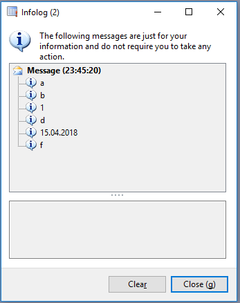
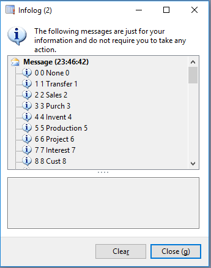
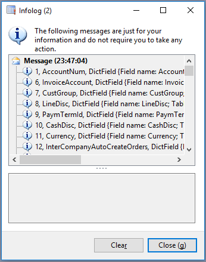

# Примеры использования SysEnumerators

## 1. [Пробежать по интервалу чисел от 2 до 9 с шагом 3](Job_SysEnumeratorExample01_Int.xpp)


```java
SysEnumerator se = SysEnumerator::newFromToInt(2, 9, 3);

while( se.moveNext() )
{
    info(strfmt("%1", se.current()));
}
```

## 2. [Пробежать по интервалу дат с шагом 5 дней](Job_SysEnumeratorExample02_Date.xpp)


```java
SysEnumerator se = SysEnumerator::newFromToDate(01\04\2018, 30\04\2018, 5);

while( se.moveNext() )
{
    info(strfmt("%1, %2", se.current(), dayofwk(se.current())));
}
```

## 3. [Пробежать по элементам контейнера](Job_SysEnumeratorExample03_Container.xpp)



```java
container c = ['a', 'b', 1, 'd', systemdateget(), 'f'];
SysEnumerator se = SysEnumerator::newFromContainer(c);

while( se.moveNext() )
{
    info(strfmt("%1", se.current()));
}
```

## 4. [Пробежать по перечислению enum](Job_SysEnumeratorExample04_Enum.xpp)



```java
LedgerTransType transType;
SysEnumerator se = SysEnumerator::newFromEnum(transType);

while( se.moveNext() )
{
    info(strfmt("%1 %2 %3 %4", se.current(), se.currentIdx(), se.currentKey(), se.currentValue()));
}
```

## 5. [Пробежать по полям таблицы](Job_SysEnumeratorExample05_Fields.xpp)



```java
LedgerTransType transType;
SysEnumerator se = SysEnumerator::newFromEnum(transType);

while( se.moveNext() )
{
    info(strfmt("%1 %2 %3 %4", se.current(), se.currentIdx(), se.currentKey(), se.currentValue()));
}
```

## 6. [Пробежать по CSV-файлу](Job_SysEnumeratorExample06_File.xpp)


```java
FileName myDocumentsFolder = WinAPI::getFolderPath(#CSIDL_Personal);
Filename fileName = myDocumentsFolder + @'\test.csv';
CommaIo commaIo = new CommaIo(fileName, 'R');
SysEnumerator_CommaIo se = SysEnumerator_CommaIo::construct(commaIo);

while( se.moveNext() )
{
    info(Con2Str(se.current()));
}
```

## 7. [Работа с группой энумераторов](Job_SysEnumeratorExample06_File.xpp)


```java
    SysEnumerator_SysOperationProgress progress = SysEnumerator_SysOperationProgress::construct();
    SysEnumerator_FillSetFromValue values2set = SysEnumerator_FillSetFromValue::construct();

    SysEnumerator se = SysEnumerator::construct()
        .add(progress)
        .add(values2set)
        .add(SysEnumerator_First::construct(1000));

    while( se.moveNext() )
    {
        // my super business logic

        progress.base().setText(strfmt("%1, %2", se.current(), values2set.base().elements()));
    }

    info(values2set.base().toString());
```
